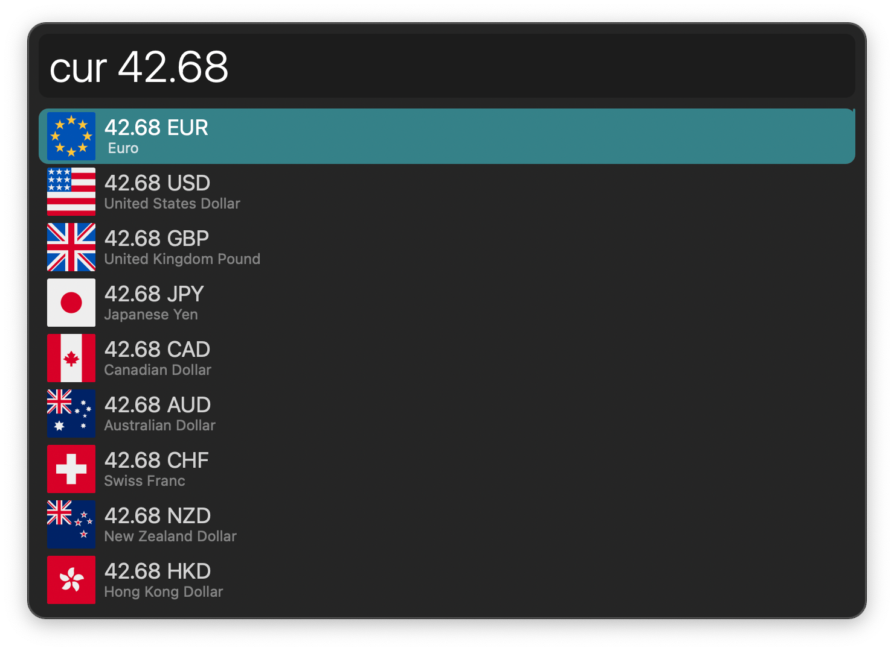
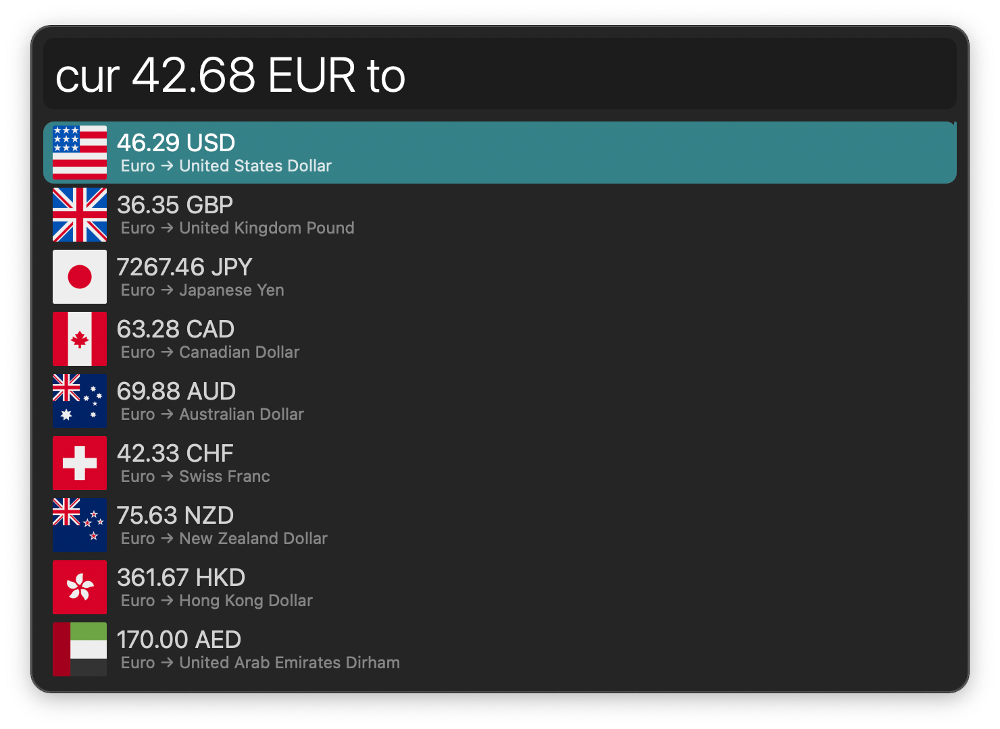
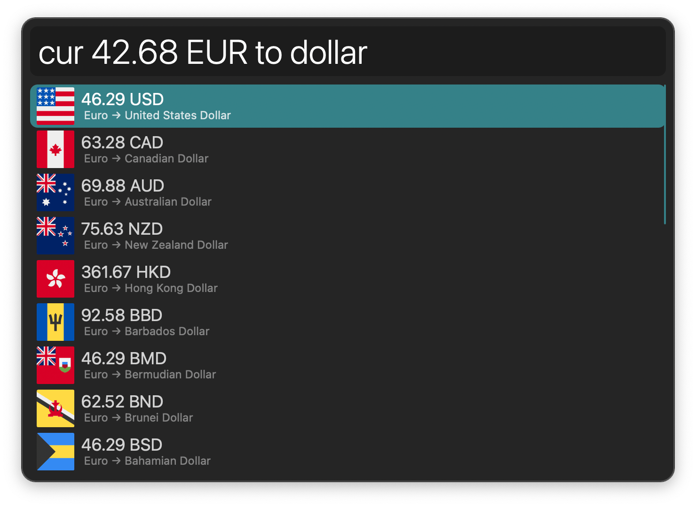
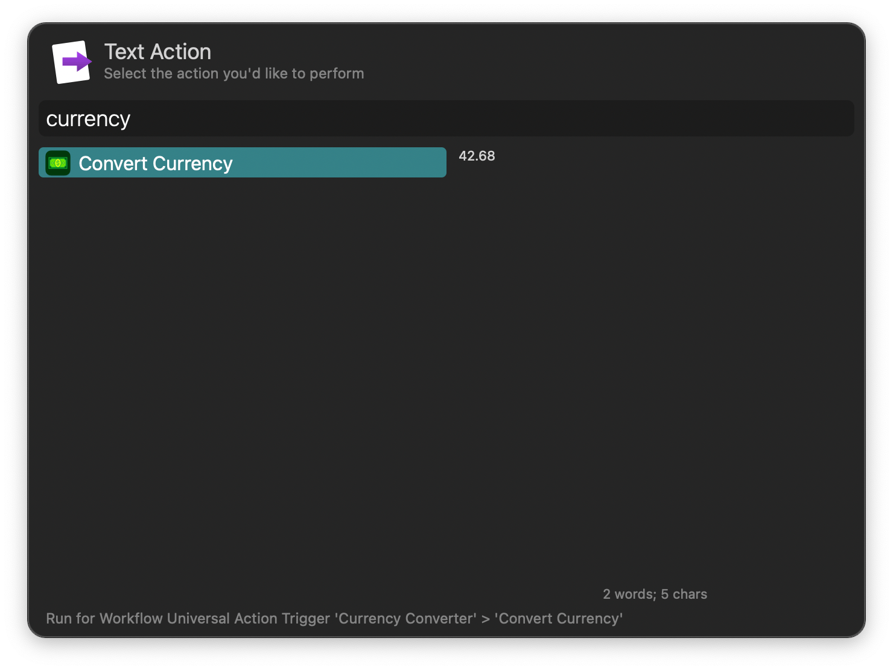

#  Currency Converter Alfred Workflow

Convert between different currencies

[⤓ Install on the Alfred Gallery](https://alfred.app/workflows/alfredapp/currency-converter)

## Usage

Convert currencies via the `cur` keyword. Type a number to see all available currencies with their full name and code.

Type a currency code or name to filter.

Pressing <kbd>↩&#xFE0E;</kbd> on a partial match triggers the autocomplete. See all conversion targets when matching a unit exactly.

Type further to filter for target units. Connector words (“to”, “as”, “in”) are optional to help with readability.

* <kbd>↩&#xFE0E;</kbd> Copy result to clipboard.
* <kbd>⌘</kbd><kbd>↩&#xFE0E;</kbd> Paste result to frontmost app.

Configure the [Hotkey](https://www.alfredapp.com/help/workflows/triggers/hotkey/) or use the [Universal Action](https://www.alfredapp.com/help/features/universal-actions/) as shortcuts to convert results from Alfred’s [Calculator](https://www.alfredapp.com/help/features/calculator/), [Clipboard History](https://www.alfredapp.com/help/features/clipboard/), or selected text.

Rates provided by [Exchange Rate API](https://www.exchangerate-api.com).
